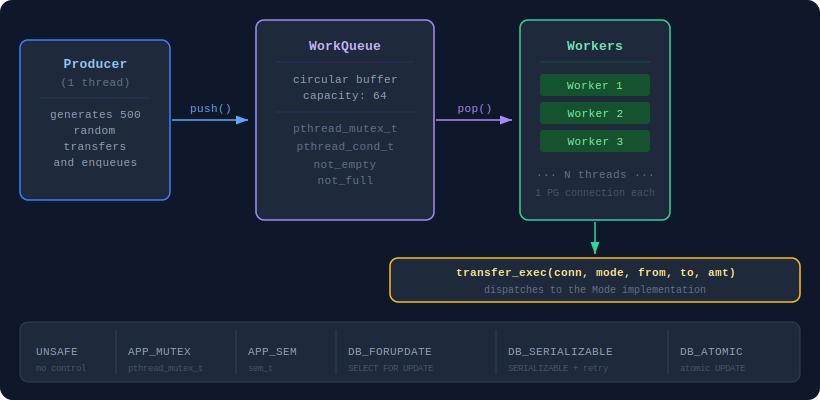

# Concurrent Bank Transfers — Race Condition Benchmark

A C program that simulates concurrent bank transfers to demonstrate and measure the impact of **race conditions**. At the end of each run it generates a full **PDF report** with results, analysis, and comparisons across six synchronization strategies, each tested with 500 parallel transfers between 10 bank accounts.

| # | Mechanism | Level |
|---|-----------|-------|
| 1 | No control | — |
| 2 | `pthread_mutex_t` | Application |
| 3 | `sem_t` (POSIX semaphore) | Application |
| 4 | `SELECT FOR UPDATE` | Database |
| 5 | `SERIALIZABLE` + retry | Database |
| 6 | Atomic `UPDATE` | Database |

---

## Requirements

| Dependency | Version | Install |
|------------|---------|---------|
| GCC | ≥ 9 | `sudo apt install build-essential` |
| libpq-dev | any | `sudo apt install libpq-dev` |
| Docker + Compose | any | [docs.docker.com/engine/install](https://docs.docker.com/engine/install) |
| Python 3 + weasyprint | ≥ 3.8 | `pip install weasyprint` |

---

## Demo video

The file [`docs/how_to_run.mp4`](docs/how_to_run.mp4) shows the project running end-to-end: dependency installation, compilation, database startup, scenario execution, and PDF generation.

---

## Quick start

**Step 1 — install dependencies (Ubuntu/Debian, run once):**

```bash
make setup
```

Installs GCC, libpq-dev, Docker, Docker Compose, and weasyprint automatically.
If Docker was just installed, run `newgrp docker` before proceeding.

**Step 2 — run:**

```bash
# Full run — checks deps, compiles, starts DB, executes, generates PDFs
make start

# Clean everything (results, binaries, container)
make clean
```

`make start` does everything in sequence:
1. Verifies all dependencies are installed (exits with a clear error if not)
2. Removes previous results and binaries
3. Compiles the project
4. Starts PostgreSQL via Docker Compose (port 5433)
5. Runs the 6 scenarios + scalability test
6. Converts the generated HTML to PDF with weasyprint
7. Stops the container and removes binaries

The report is saved to `results/report_YYYYMMDD_HHMMSS.pdf`.

> `results/`, `bin/`, and `build/` are in `.gitignore` — they are created at runtime and are not part of the repository.

---

## Architecture

The program uses the **producer-consumer** pattern with a shared circular work queue between threads.



**Scenario flow:**

1. `db_reset()` — zeroes all balances, guarantees a clean starting state
2. The producer generates N random transfers and pushes them onto the queue
3. N workers consume the queue in parallel, each with its own database connection
4. Once the queue is empty, all workers exit
5. `db_total()` — sums all balances and compares with the initial total
6. Any difference indicates a race condition

---

## Project structure

```
.
├── include/
│   ├── database.h    — DB constants and connection/query interface
│   ├── queue.h       — circular buffer with pthread_mutex_t + pthread_cond_t
│   ├── transfer.h    — Mode enum and transfer_exec() signature
│   ├── result.h      — Result struct (discrepancy, time, db_calls, retries)
│   └── report.h      — report generation API
├── src/
│   ├── main.c        — orchestration: ProducerArgs, workers, run_scenario()
│   ├── database.c    — pg_connect(), db_reset(), db_total(), pg_read_balance(), pg_write_balance()
│   ├── queue.c       — wq_push(), wq_pop(), wq_done() with synchronization
│   ├── transfer.c    — 6 transfer_exec() implementations, one per Mode
│   └── report.c      — reads templates/, substitutes placeholders, writes HTML
├── templates/
│   ├── report.html   — report template with {{PLACEHOLDER}} tokens
│   └── style.css     — ABNT formatting (A4, Arial 12pt, 1.5 line spacing)
├── docs/
│   ├── architecture.svg          — architecture diagram
│   └── project_specification.pdf — original assignment spec
├── scripts/
│   └── setup.sh                  — dependency installer
├── results/          — generated PDFs (created automatically)
├── docker-compose.yml
└── Makefile
```

---

## How the report is generated

The report uses no PDF library — the pipeline has three steps:

1. **C generates HTML**: `report.c` reads `templates/report.html`, replaces each `{{PLACEHOLDER}}` with live benchmark data (tables, metrics, badges), and saves the result to `results/report_*.html`

2. **Python converts to PDF**: the Makefile calls weasyprint via Python to convert the HTML to PDF

3. **HTML is deleted**: only the final PDF remains in `results/`

Available placeholders in the template:

| Placeholder | Content |
|-------------|---------|
| `{{CSS}}` | Inlined `style.css` content |
| `{{GENERATED_AT}}` | Report generation date and time |
| `{{CFG_ROWS}}` | Configuration table rows |
| `{{SCN_N_DYNAMIC}}` | Result callout + metrics for scenario N |
| `{{SCN_N_BADGES}}` | Status and level badges for scenario N |
| `{{SUMMARY_ROWS}}` | Comparative summary table rows |
| `{{SCALING_ROWS}}` | Scalability table rows |
| `{{BEST_CALLOUT}}` | Callout highlighting the best-performing mechanism |

---

## Database configuration

Defined in `include/database.h` and `docker-compose.yml`:

| Parameter | Value |
|-----------|-------|
| Image | `postgres:16-alpine` |
| Port | `5433` (avoids conflict with local instances on 5432) |
| User / Password | `banco` / `banco` |
| Database | `banco` |
| Accounts | 10 (table `accounts`) |
| Initial balance | R$ 1,000.00 per account |


---

🇧🇷 Prefere ler em português? Veja [README.pt.md](README.pt.md)
